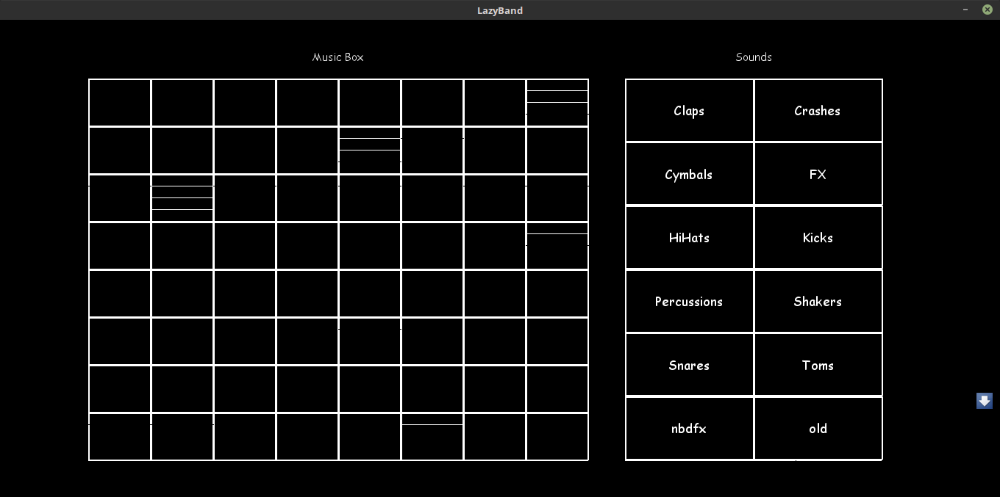

# LazyBand
LazyBand is an electronic music generator that takes in sound and produces electronic music from your creativity. It is written in python.

Here the Music board is our electronic board which produces music and Sounds are all the sound categories available to us in the sounds directory.

In the music board -
1. As we go from left to right in a row the volume in cells increase. The leftmost cell will play the sound with minimum volume and the rightmost cell will play the sound with the maximum volume, both can be adjusted by setting values in [common.py](common.py). See below for instructions. (By default it is 20% - 100%)
2. As we go from top to bottom the loop duration of the cell increases. The topmost cell will loop the sound after minimum duration and the bottommost cell will loop the sound after maximum duration, both can be adjusted by setting values in [common.py](common.py). See below for instructions. (By default it is 0.3 - 2 seconds)

### Steps to make it run
1. Install the required libraries from requirement.txt
2. Run the server on some machine (By default its localhost). You can change the IP address in the file utils.py if you want to use the collaboration service.
3. After running the server, run gui.py

### Adding Sounds
1. You can add more fun sounds by creating a folder in the sounds directory and putting all your sounds in that folder.
2. The sounds can be anything as long as they are 16 bit .wav files
3. The directory you made will automatically pop in the sound box when you run the gui

### Operating
1. Clicking on any of the directory name in the sound box will open that directory and update the sound box with all the sounds in that directory.
2. Clicking on any of the sounds will play it for preview
3. Clicking on any sound also selects it, just click again on any cell of the Music box to assign that music to that cell.
4. When a music is assigned to a cell on the music box it is shown by a white line
5. If you click on any of the cells with white lines, the least recently added music on that grid will be deleted
6. Clicking anywhere outside (Not in any box) will take you back to the directory view where you can see the directory names again.
7. By default only 4 sounds can be added in a cell. It can be tweaked though ;)

### Tweaking
You can tweak lots of things by changing values in the file common.py
1. To change the number of rows and colums in the Music Box and provide better granularity you can set the number of rows and columns by setting values for GRID_ROW and GRID_COLUMN in the file [common.py](common.py)
2. You can set the volume range and setting MIN_VOLUME and MAX_VOLUME in the file [common.py](common.py). It can range from 0 to 1 where is 1 is the maximum volume available.
3. You can change the minimum and maximum loop duration by setting MIN_DURATION and MAX_DURATION in file [common.py](common.py)
4. You can change the maximum sounds per cell by setting the LINE_COUNT in [common.py](common.py)

## Authors
[Shikhar Srivastava](https://github.com/shikharsrivastava/)
[Param Singh](https://github.com/paramsingh/)
[Abhishek Rastogi](https://github.com/princu7)

 
